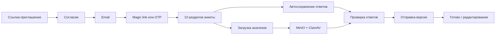

# SaaS «Опросник для специалиста»

Локальный MVP защищённого опросника для специалиста по ментальному и физическому здоровью.

Клиент получает ссылку, принимает согласие на обработку данных, входит без пароля по magic link или одноразовому коду, заполняет фиксированную анкету, прикладывает имеющиеся анализы и отправляет ответы специалисту. Проект подготовлен как самостоятельный модуль, который в дальнейшем можно подключить к большой платформе специалиста, её админке и AI-агентам.

## Что умеет проект

- открывает публичную ссылку-приглашение на анкету;
- отдельно фиксирует согласие пользователя;
- выполняет passwordless-вход по magic link или шестизначному OTP-коду;
- показывает 10 разделов и 46 фиксированных вопросов;
- сохраняет ответы автоматически и при переходе между разделами;
- позволяет выбрать только один вариант там, где вопрос предполагает single choice;
- оставляет поле комментария после каждого вопроса, в том числе после ответа «Нет»;
- поддерживает условные уточняющие поля;
- принимает файлы анализов через приватное S3-совместимое хранилище;
- проверяет загруженные файлы через ClamAV в отдельном scan-worker;
- показывает страницу проверки перед отправкой;
- сохраняет отправленную версию отдельно от текущих ответов;
- позволяет начать редактирование после отправки, не уничтожая историю отправки;
- работает адаптивно на desktop и mobile;
- содержит автоматические unit/integration-тесты и один полный Playwright-сценарий клиентского пути.

Это учебный MVP, а не медицинская система принятия решений: приложение не ставит диагнозы и не формирует медицинские рекомендации.

## Технологии

- Python 3.12;
- FastAPI — HTTP-маршруты и серверная логика;
- Jinja2 — HTML-шаблоны;
- Vanilla JavaScript и CSS — интерфейс без тяжёлого frontend-фреймворка;
- PostgreSQL 17 — основная база данных;
- SQLAlchemy 2 — ORM и работа с моделями;
- Alembic — миграции базы данных;
- Mailpit — локальный SMTP-перехватчик для тестовых писем;
- MinIO — локальное S3-совместимое хранилище документов;
- ClamAV — антивирусная проверка файлов;
- Docker Compose — запуск связанных сервисов;
- pytest и Playwright — автоматическая проверка.

## Как работает клиентский путь



### Вход

1. Клиент открывает ссылку `http://127.0.0.1:8000/i/local-test`.
2. Ставит отдельную галочку согласия.
3. Вводит email.
4. В локальной среде письмо появляется в Mailpit: `http://127.0.0.1:8025`.
5. Клиент либо открывает magic link, либо вводит шестизначный код.

### Анкета

После входа клиент проходит разделы:

1. Личные данные
2. Образ жизни
3. Цели и мотивация
4. История здоровья
5. Питание
6. ЖКТ и самочувствие
7. Сон и стресс
8. Гендерное здоровье
9. Активность и привычки
10. Готовность и детали

Обязательные ответы проверяются сервером. Ответы сохраняются по мере работы, поэтому клиент может вернуться к анкете позже.

### Файлы

Для документов создаётся запись в PostgreSQL, а сам файл отправляется в приватный bucket MinIO. До успешной проверки файл находится в quarantine-состоянии. Scan-worker передаёт его ClamAV и переводит документ в `ready` или `rejected`.

### Отправка и история

Текущие ответы находятся в черновике. Перед отправкой пользователь видит страницу проверки. При отправке создаётся отдельная версия в `submissions`. Если пользователь позже редактирует анкету, актуальные ответы меняются, но отправленная версия и её история остаются сохранёнными.

## Архитектура

```text
Browser
  |
  v
FastAPI + Jinja + Vanilla JS
  |              |                 |
  v              v                 v
PostgreSQL     MinIO             Mailpit
  |              |
  v              v
answers /      documents       ClamAV
submissions    metadata        scan-worker
```

В локальном Compose используются два слоя:

- `compose.yaml` — базовые сервисы PostgreSQL и ClamAV;
- `compose.local.yaml` — локальные web, scan-worker, Mailpit, MinIO, миграции и seed.

Запускать их нужно вместе. `compose.local.yaml` отдельно не является самостоятельным файлом.

## Быстрый запуск

### Требования

- Docker Desktop с включённым Docker Engine;
- Docker Compose v2;
- для запуска тестов локально — Python 3.12 и `uv`.

### Запуск через Docker Compose

Из корня репозитория:

```powershell
docker compose -f compose.yaml -f compose.local.yaml up -d
```

Проверка состояния:

```powershell
docker compose -f compose.yaml -f compose.local.yaml ps
```

Проверка web-сервиса:

```text
http://127.0.0.1:8000/health
```

Основные локальные адреса:

| Сервис | Адрес | Назначение |
|---|---|---|
| Анкета | http://127.0.0.1:8000/i/local-test | Клиентский вход |
| Mailpit | http://127.0.0.1:8025 | Просмотр тестовых писем |
| MinIO Console | http://127.0.0.1:9001 | Просмотр локального object storage |
| PostgreSQL | `127.0.0.1:55432` | Локальное подключение к БД |

Локальные credentials находятся только в dev-конфигурации `compose.local.yaml` и не предназначены для production.

### Локальная установка зависимостей и тесты

```powershell
uv sync
.venv\Scripts\python.exe -m pytest -q
```

Проверка полного браузерного сценария:

```powershell
.venv\Scripts\python.exe -m pytest tests\test_browser_e2e.py -q
```

Проверка стиля:

```powershell
.venv\Scripts\ruff.exe check app tests
```

## Где хранятся данные

В локальной среде данные сохраняются в Docker volumes:

- `saas_health_intake_pgdata` — PostgreSQL;
- `saas_health_intake_minio_data` — MinIO и загруженные объекты;
- `saas_health_intake_mailpit_data` — локальные тестовые письма;
- `saas_health_intake_clamav_db` — база ClamAV.

Основные таблицы PostgreSQL:

| Таблица | Назначение |
|---|---|
| `workspaces` | Изолированное пространство проекта |
| `clients` | Клиенты и email |
| `consents` | Зафиксированные согласия |
| `questionnaire_responses` | Карточка анкеты и её состояние |
| `answers` | Текущие ответы по вопросам |
| `submissions` | Неизменяемые снимки отправленных версий |
| `documents` | Метаданные файлов и статусы проверки |
| `audit_events` | История действий |

## Основные файлы и функции

| Файл | Что в нём находится |
|---|---|
| `app/main.py` | FastAPI-приложение, маршруты входа, анкеты, review, submit и документов |
| `app/questionnaire_v1.json` | Фиксированный шаблон из 10 разделов и 46 вопросов |
| `app/questionnaire.py` | Загрузка и валидация структуры шаблона |
| `app/answers.py` | Нормализация и проверка ответов, построение snapshot |
| `app/questionnaire_service.py` | Черновик, revision, автосохранение, отправка и редактирование |
| `app/auth_service.py` | Magic link, OTP, rate limit и passwordless-сессии |
| `app/preauth.py` | Подписанный билет согласия до входа клиента |
| `app/models.py` | SQLAlchemy 2 модели PostgreSQL |
| `app/documents_service.py` | Upload intent, статусы, скачивание и удаление документов |
| `app/documents_scan_service.py` | Очередь проверки и lease-механика scan-worker |
| `app/scan_worker.py` | S3/MinIO и ClamAV-проверка файлов |
| `app/email.py` | Формирование и отправка писем с magic link и OTP |
| `app/security.py` | Хеширование токенов, email/IP fingerprint и проверка подписи |
| `static/questionnaire.js` | Автосохранение и поведение формы в браузере |
| `static/app.css` | Адаптивный интерфейс анкеты |
| `templates/access.html` | Согласие и passwordless-вход |
| `templates/questionnaire.html` | Разделы и карточки вопросов |
| `templates/lifecycle.html` | Проверка, отправка, экран готовности и редактирование |
| `migrations/versions/20260825_0001_initial.py` | Начальная схема БД, ограничения и RLS-политика |
| `compose.yaml` | Базовые PostgreSQL и ClamAV |
| `compose.local.yaml` | Локальный полный стенд |
| `compose.deploy.yaml` | Production/staging overlay с внешними SMTP и S3 |
| `tests/test_browser_e2e.py` | Полный сценарий клиента на desktop/mobile и работа с файлами |

## Ограничения учебной версии

- анкета фиксированная, конструктора вопросов нет;
- отдельной админ-панели специалиста в этой версии нет;
- Mailpit и MinIO используются только локально;
- production требует HTTPS, настоящего SMTP relay, приватного S3, секрет-хранилища, резервного копирования и отдельного операционного регламента;
- AI-агенты и медицинские рекомендации подключаются на следующем уровне большой платформы, после передачи структурированной карточки анкеты.

## Статус

Локальный MVP запускается через Docker Compose. Проверены passwordless-вход, все 10 разделов, автосохранение, single-choice, комментарии, мобильная вёрстка, загрузка и проверка файлов, review, отправка и редактирование.
